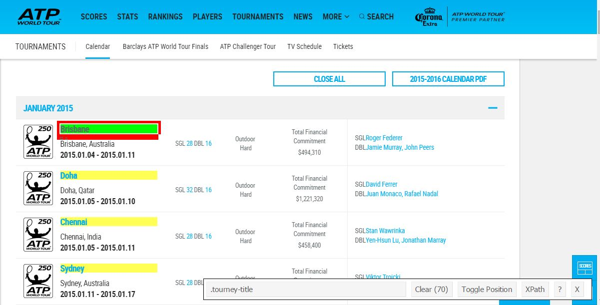

```{r echo=FALSE, message=FALSE, warning=FALSE}
library(knitr)
opts_chunk$set(message = FALSE,
               warning = FALSE)

```

**R** can be used to retreive data from many sources and in many different formats.  R also has the potential, via some fantastic packages, to scrape/harvest data from the web, which is how we will collect data for the various tennis players we will need to look at.

We'll use a number of R packages to do this, including `jsonlite` which is used to parse JSON data, and `rvest` which can be used on websites to target and select html tags and return the _data_ found on webpages.

The ATP site contains a lot of data, and it can be filtered for various summary stats that are to be used in some of the `servevolleyR` functions.

## tournaments

Collecting data about the various tournaments throughout the year will be useful, things like start date, end date, court surface, etc, can be used to either schedule future tasks, or filter relevant player data.  The [tournaments](http://www.atpworldtour.com/en/tournaments) homepage appears to show all the tournaments from that calendar year, whether completed or not.  To get this data we'll use the `rvest` package built by Hadley Wickham (if you use R there's a good chance you reside for part of the time in Hadleyverse), which can be used to **easily harvest (scrape) web pages**, and `stringr` (also by Hadley) to clean some of the data.

<div class="row">
<div class="col-sm-4">

To make selecting the various elements of a webpage easier, we'll also use the [selectorgadget](http://selectorgadget.com/) tool recommended by `rvest`.  This tool allows you to hover over displayed content and will return the html tags to select that content, this is much easier than trawling through the raw HTML for tags (as I used to do).  SelectorGadget can be seen in action to the right, as it selects the tournament names, and returns the tags `.tourney-title` that are to be used in the code belwo to select those elements.

</div>
<div class="col-sm-8">

</div>
</div>

```{r}
library(rvest)
library(stringr)
# read in HTML document 
tourney_page <- html("http://www.atpworldtour.com/en/tournaments")

tourney <- tourney_page %>%
    html_nodes(".tourney-title") %>%
    html_text()

tourney_link <- tourney_page %>%
    html_nodes(".tourney-title") %>%
    html_attr("href")

tourney_location <- tourney_page %>%
    html_nodes(".tourney-location") %>%
    html_text() %>%
    str_replace_all("[[:cntrl:]]", "")

tourney_date <- tourney_page %>%
    html_nodes(".tourney-dates") %>%
    html_text() %>%
    str_replace_all("[[:cntrl:]]", "")

tourney_surface <- tourney_page %>%
    html_nodes(".tourney-details:nth-child(2) .item-details") %>%
    html_text() %>%
    str_replace_all("[[:cntrl:]]", "")

```

The code above returns vectors of data about the tournaments, the name (`tourney`), the url (`tourney_link`), the location (`tourney_location`), the date (`tourney_date`) and the surface (`tourney_surface`).  One word of caution, web developers can change their sites, which can cause some of this code to break, so it may require updating and adjusting over time, but the tools are there to make this a relatively simple process.  The vectors above can be combined into a dataframe, the first 6 rows are then printed, and we can also write the dataframe to a spreadsheet:

```{r}
tourneys <- data.frame(name = tourney,
                       link = tourney_link,
                       venue = tourney_location,
                       date = tourney_date,
                       surface = tourney_surface,
                       stringsAsFactors = FALSE)

head(tourneys)
write.csv(x = tourneys, file = "data/tournaments.csv", row.names = FALSE)
```

## player pages and data

Individual players stats are found on their own page, we need to know these individual urls in order to get the relevant data.  This data can be quickly retrieved using R (or other programming languages), for either a collection of players or individuals, the url [`http://www.atpworldtour.com/-/ajax/playersearch/PlayerUrlSearch?`](http://www.atpworldtour.com/-/ajax/playersearch/PlayerUrlSearch?) returns a JSON object with the players name and the partial url to their profile page.

If we wanted to search for all players called _andy_ then we can do it using the code below, which converts the JSON into a list with an items object that holds a nice dataframe of players and their urls.  First we load the `jsonlite` package using `libary(jsonlite)`, then use the `fromJSON()` function to parse the json, before printing the first 6 rows of our new dataset with `head()`

```{r}
library(jsonlite)
andy <- fromJSON("http://www.atpworldtour.com/-/ajax/playersearch/PlayerUrlSearch?SearchTerm=andy murray")
head(andy$items)
```

If you go to `r paste0("http://www.atpworldtour.com", head(andy$items, 1)$Value)`, then it should take you to _`r paste0(head(andy$items, 1)$Key)`_'s profile page, which includes various sections about the player.  It takes you to the overview page, the data we want for the various functions found in `servevolleyR` is behind the player stats tab, shown below.  When selecting that tab the url changes from `overview` to `player-stats`, this can be done in R using the following:
```{r}
(andymurray <- andy$items$Value[1])
(andymurray <- gsub("overview", "player-stats", andymurray))
```


