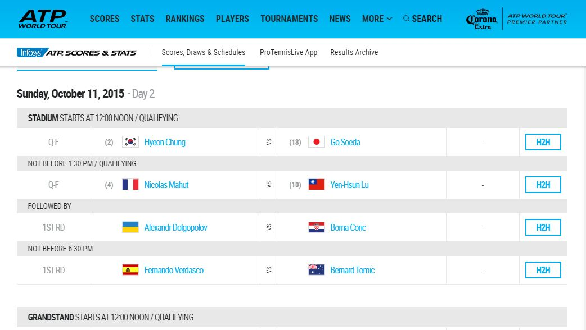

```{r echo=FALSE, message=FALSE, warning=FALSE}
library(knitr)
opts_chunk$set(message = FALSE,
               warning = FALSE)

```


Load the necessary packages, `rvest` for parsing HTML pages, `stringr` for manipulating strings and extracting data from characters, `jsonlite` to parse JSON data, and `dplyr` to manipulate data.

```{r}
library(rvest)
library(stringr)
library(jsonlite)
library(dplyr)
```

<div class="row">
<div class="col-sm-4">

Matches scheduled for _today_ can be found on the individual tournament pages, the screenshot to the right shows the some of the matches scheduled for October 11th 2015 in the ATP World Tour Masters tournament.  We looked at how to harvest data on invididual tournamets [here](tournament-data-collection.html), the data included url links to each individual tournaments as well as the dates the tournament is being played, which means we can use this to get _todays_ matches.

</div>
<div class="col-sm-8">

</div>
</div>

The tournaments csv file we created ([here](https://github.com/durtal/talks/blob/gh-pages/traders-conference/example/data/tournaments.csv)) is used to get the relevant data, save us from unneccesarily harvesting more ATP data (this file will likely need updating ahead of 2016).  The data is then filtered down to tournaments starting today.

```{r eval=FALSE}
tourneys <- read.csv("data/tournaments.csv", stringsAsFactors = FALSE)
tourneys$start_date <- as.Date(tourneys$start_date)
tourneys$end_date <- as.Date(tourneys$end_date)

current_tourneys <- subset(tourneys,
                           start_date <= Sys.Date() &
                           end_date >= Sys.Date())
```

For each tournament in `current_tourneys` we want to find the schedule, the code below shows how this is done for the first row in the `current_tourneys` dataset.  We first create the url using the `link` in the dataset above, and the `base url` of the ATP website, which is `http://www.atpworldtour.com`, a few other changes are made to the url:

```{r eval=FALSE}
tournament_url <- paste0("http://www.atpworldtour.com", current_tourneys$link[1])
tournament_url <- gsub("overview", "daily-schedule", tournament_url)
tournament_url <- gsub("tournaments", "scores/current", tournament_url)
```

With our tournament specific url, we can then use `rvest` to harvest the data and matches from today.  The code below parses the webpage with `html`, then collects data on the round of the tournament (`rd`), the name of playerA, playerB and the tour (`atp`).   The `atp` variable is important as it allows us to filter to just mens singles, as this variable contains a head-to-head link, doubles matches do not, and womens matches have WTA.  We build a dataframe of out matches, which is then filtered

```{r eval=FALSE}
page <- html(tournament_url)

rd <- page %>%
    html_nodes(".day-table-round") %>%
    html_text() %>%
    str_replace_all("[[:cntrl:]]", " ") %>%
    str_trim(side = "both")

playerA <- page %>%
    html_nodes(".day-table-name:nth-child(4)") %>%
    html_text() %>%
    str_replace_all("[[:cntrl:]]", " ") %>%
    str_trim(side = "both")

playerB <- page %>%
    html_nodes(".day-table-name:nth-child(8)") %>%
    html_text() %>%
    str_replace_all("[[:cntrl:]]", " ") %>%
    str_trim(side = "both")

atp <- page %>%
    html_nodes(".day-table-button") %>%
    html_text() %>%
    str_replace_all("[[:cntrl:]]", " ") %>%
    str_trim(side = "both")

todays_matches <- data.frame(name = current_tourneys$name[1],
                  venue = current_tourneys$venue[1],
                  tourney_dates = current_tourneys$date[1],
                  surface = current_tourneys$surface[1],
                  date = Sys.Date(),
                  rd = rd,
                  playerA = playerA,
                  playerB = playerB,
                  atp = atp,
                  stringsAsFactors = FALSE)

todays_matches <- todays_matches %>%
    filter(grepl("H2H", atp))
```