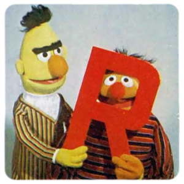

# Introduction to R
## Programming for Punters

 

 

<h3 class="name">Tom Heslop</h3>
<h3 class="name"><a href="https://twitter.com/UTVilla">@UTVilla</a></h3>

 

 

<ul class="slide-list">
    <li>slides <a href="http://bit.ly/1UNtCQ3">http://bit.ly/1UNtCQ3</a></li>
    <li>source <a href="http://bit.ly/1O9fAE2">http://bit.ly/1O9fAE2</a></li>
</ul>

<aside class="notes">
    
Introduce myself. Thank Scott Ferguson. Thank Matchbook

    
Slides found here.

</aside>

--- &vertical .title

<h1 class="slide-title">Subjects to Cover</h1>

***

<ul class="subject-list">
    <li class="name">Introduce <a href="https://cran.r-project.org/">R</a></li>
     
    <li class="name">Introduce <a href="https://git-scm.com/">Git</a> (very briefly)</li>
     
    <li class="name">
        Build your own R packages
         
        <ul>
            <li><a href="http://durtal.github.io/RcappeR/">RcappeR</a> - horse racing</li>
            <li><a href="http://durtal.github.io/servevolleyR/">servevolleyR</a> - tennis</li>
            <li><a href="http://durtal.github.io/betfaiR/">betfaiR</a> - Betfair (incomplete)</li>
        </ul>
    </li>
     
    <li class="name">Use R, Git, other open source tools to manage projects/analysis</li>
</ul>

<aside class="notes" style="font-size: 10px">
    
Introduce R, what it is, some packages.

    
Introduce Git, briefly, important when writing lots of code.

    
Build your own tools, talk about a couple of R packages I've built.

    
An example use case, involving servevolleyR, some other R packages, and Make.

</aside>

--- &vertical

<h1 class="slide-title">Background</h1>

<aside class="notes" style="font-size: 10px">
    
No programming background, entirely self taught.

    
If anyone can guess what I studied at Uni there's a drink waiting for them.

</aside>

***

<h3 style="text-align: left">January 2013</h3>
<h3>an Excel user</h3>

    

<aside class="notes" style="font-size: 10px">
    
Using Excel meant a lot of manual data entry, usually horse racing, very time-consuming.

    
Excel also used for basic analysis, but has limitations.

    
Excel benefits are that you can see and visually inspect data quite easily.

</aside>

***

<h3 style="text-align: left">May 2013</h3>
<h3>What is R?</h3>

    

<aside class="notes" style="font-size: 10px">
    
Frustrated at Excel freezing and crashing.

    
Must be something better, seen Mike Bailey (@ slipperytoad) tweet about R.

    
Curiosity aroused.

    
I had a project in mind to keep me motivated - make my horse racing work easier.

</aside>

***

<h3 style="text-align: left">June 2013</h3>
<h3>Type first R command</h3>

    

<aside class="notes" style="font-size: 10px">
    
First R commands.

    
Excited at potential, very basic commands like `summary` and `plot`, but I made a mess.

    
Just wrote code.

</aside>

***

<h3 style="text-align: left">June 2014</h3>
<h3>I understand...</h3>

    
    <h3>...no I don't</h3>

<aside class="notes" style="font-size: 10px">
    
Every so often I felt like I was making no progress despite my best efforts.

</aside>

***

<h3 style="text-align: left">December 2014</h3>
<h3>Release my second R package</h3>

    

<aside class="notes" style="font-size: 10px">
    
Every so often I felt like I was invincible... I wasn't.

    
Released my second R package, which helped with horse racing analysis, we'll see some of it later.

</aside>

***

<h3>always learning...</h3>

<aside class="notes" style="font-size: 10px">
    
Timeline since June 2013 looks like this, moments of despair, failure, struggle.

    
punctured with moments of triumph, small successes.

    
I'm always learning.

    
so tag of 'R programming specialist' is a bit of marketing, still learning every day.

</aside>

--- &vertical .title

<h1 class="slide-title">What is R?</h1>

***

<h2><a href="https://www.r-project.org/">R is a free software environment for statistical computing and graphics</a></h2>

<aside class="notes" style="font-size: 10px">
    
From official R homepage

</aside>

***

<h2 style="text-align:left">R is...</h2>
<h3>...open source</h3>
<h3>...a programming language</h3>
<h3>...data analysis software</h3>
<h3>...a community</h3>

<aside class="notes" style="font-size: 10px">
    
I'll run through each of these quickly, and why they are important to any analysis you hope to do.

</aside>

***

## open source

It's free to use on Windows, Linux and OSX.

The source code is available to read, inspect, learn from.

***

## programming language

***

## data analysis software

***

## a community

***

<blockquote class="twitter-tweet" lang="en">
The only way to write good code is to write tons of shitty code first. Feeling shame about bad code stops you from getting to good code
&mdash; Hadley Wickham (@hadleywickham) <a href="https://twitter.com/hadleywickham/status/589068687669243905">April 17, 2015</a></blockquote>

***

## Learn R

* [Coursera courses run by Johns Hopkins](https://www.coursera.org/specialization/jhudatascience/1?utm_medium=courseDescripTop)
    - [R Programming](https://www.coursera.org/course/rprog)
    - [Data Science Toolbox](https://www.coursera.org/course/datascitoolbox)
    - includes introduction to git/github
* [Statistical Learning by Stanford](https://class.stanford.edu/courses/HumanitiesScience/StatLearning/Winter2014/about)
    - accompanied by free book ([Introduction to Statistical Learning](http://www-bcf.usc.edu/~gareth/ISL/))
* [Stat545 by University of British Columbia](http://stat545-ubc.github.io/index.html)
    - course notes for Data Wrangling, Exploration and Analysis with R
    - includes introduction to git/github
* start writing code
* write more code

--- &vertical .title

<h1 class="slide-title">What is Git?</h1>

***

<h2><a href="https://git-scm.com">Git is a free and open source distributed version control system designed to handle everything from small to very large projects with speed and efficiency</a></h2>

***

<h3>without git</h3>

multiple files with very similar work

<ul>
    <li><code>analysis.R</code></li>
    <li><code>analysis-1.R</code></li>
    <li><code>data.csv</code></li>
    <li><code>data-2.csv</code></li>
    <li><code>final-data.csv</code></li>
    <li><code>final-report.docx</code></li>
    <li><code>report.docx</code></li>
    <li><code>tmp.R</code></li>
</ul>

<h3>with git</h3>

git keeps track of changes over <strong>time</strong>

<ul>
    <li><code>analysis.R</code></li>
    <li><code>data.csv</code></li>
    <li><code>final-report.docx</code></li>
</ul>

***

## An example

be like Doc Brown and time travel

--- &vertical .title

<h1 class="slide-title">RcappeR</h1>

***

### R package to aid the analysis and cleaning of horse racing data

[help pages](http://durtal.github.io/RcappeR/)

--- &vertical .title

<h1 class="slide-title">servevolleyR</h1>

***

### R package to simulate tennis points, games, tiebreaks, sets and matches

[help pages](http://durtal.github.io/servevolleyR/)

--- .title

<h2>Me</h2>

<h3><a href="https://twitter.com/UTVilla">@UTVilla</a></h3>
<h3><a href="https://github.com/durtal">github/durtal</a></h3>
<h3><a href="http://durtal.github.io/">durtal.github.io</a></h3>
<h3 style="color:#d9220f">t_heslop@hotmail.co.uk</h3>
